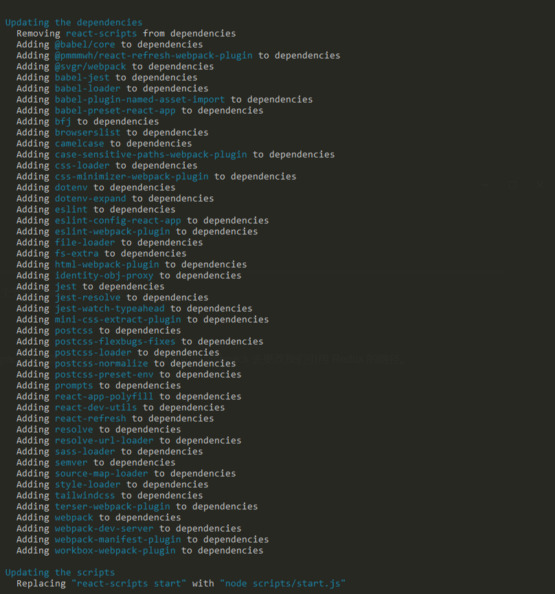

# Redux 源码阅读（一）：源码调试

## 版本信息

开发环境、npm包版本信息：

| 名称 | 版本 |
| ---- | ---- |
| yarn | 1.22.17 |
| redux | 5.0.0-alpha.0 |
| react | 18.1.0 |
| OS | Microsoft Windows [版本 10.0.19044.1645] |
| Google Chrome | 版本 103.0.5057.3（正式版本）dev （64 位） |


## 初始化React项目

### 创建React项目

通过 `create-react-app` 脚手架创建一个支持 typescript 的 React 项目，`<project name>`为需要填入的项目名称

```
# npx
npx create-react-app <project name> --template typescript

# yarn
yarn create react-app <project name> --template typescript 

# or
npm install -g create-react-app 
create-react-app <project name> --template typescript 
```

Tips：如果不加 `--template`，只是 `--typescript` ，项目只是支持 ts ，本身模板不会升级到 ts。 

### run eject scripts

运行 `eject` scripts命令，可以将 webpack 等配置或依赖项放开（不可逆，若不需要自定义配置则跳过），这里只是为了方便后续自定义配置。

```
yarn eject 
# or 
# npm run eject
```



### 安装 Redux

```
# Yarn
yarn add redux

# NPM
npm install redux
```

## Clone Redux

从 Github 克隆 [Redux](https://github.com/reduxjs/redux) 仓库到本地

```
git clone --depth 1 --branch master git@github.com:reduxjs/redux.git
```

### 打包 Redux

```
# Yarn
yarn install 
yarn build 

# NPM 
npm install 
npm run build 
```

build 之后可以看到会打包出不同版本的 Redux 文件。


打开  `rollup.config.js` 文件，可以看到不同版本的构建信息


- CommonJS

  - lib/redux.js

- ES

  - es/redux.js

- ES for Browsers

  - es/redux.mjs

- UMD Development

  - dist/redux.js

- UMD Production

  - dist/redux.min.js

### 添加 Source Map

在output 配置中添加 `sourcemap:true` 配置，打包后会在原有目录下多输出一份`*.js.map` 文件，可进行 Source Map 源码调试。

```diff
{
    input: 'src/index.ts',
-   output: { file: 'es/redux.js', format: 'es', indent: false },
+   output: { file: 'es/redux.js', format: 'es', indent: false, sourcemap: true, },
    external,
    plugins: [
     	// ... 
    ]
},
```

## Redux Link

### Link Redux 到全局

通过 `npm link` 命令，我们 clone 下来的 redux 项目会被链接到全局。

```
cd redux
npm link
```


根据 [npm Docs (Version 6.x)](https://docs.npmjs.com/cli/v6/commands/npm-link/) 文档描述， `npm link` 成功的话，会把库包链接到 `{prefix}/lib/node_modules/<package>`  


为了验证 `npm link` 是否成功，我们先通过 `npm config get prefix` 命令查看 `prefix` 值，在这里是`C:\Users\admin\AppData\Roaming\npm` 


再进入到 `{prefix}/lib/node_modules/<package>` 目录下看 `redux` 是否被链接到全局。


进入到 `{prefix}` 目录后，会发现并没有 `lib` 目录（与官方文档描述不符）。那么直接进入到 `node_modules` 目录，会发现，此时 `redux` 已被链接到全局，并且是以快捷方式创建的文件。

Tips：需要注意的是，这里链接到全局的 redux 模块的命名，并不是根据我们 clone 的项目的文件名来命名的，而是根据 `package.json` 里边的 `name` 字段命名的，也就是包名。


### 引用全局 Redux

刚刚经过 `npm link` 已经把我们 clone 下来的 redux 模块链接到全局 `node_modules` 。接下来，我们只需要在 react 项目根目录下，通过 `npm link redux` 命令，把我们 react 项目中引用的 `redux` 模块链接到全局 `node_modules` 。

```
#cd <React Project Name>
npm link redux 
```


link 成功后，会输出当前项目 redux 的引用关系：当前项目引用的 redux 模块 -> 全局 redux模块 -> 克隆下来的 redux 模块

```
D:\workspace\source-code-debugger\react-redux-debugger\node_modules\redux -> C:\Users\admin\AppData\Roaming\npm\node_modules\redux -> D:\workspace\Open-Github\redux
```

## 源码调试

### 确定模块入口

先 cd 到 redux 根目录下，查看  `package.json` 文件的信息，确定下模块入口。


这里 `module` 字段为 `es/redux.js` ，那我们只需要在 `es/redux.js` 文件里打 debugger 断点调试即可。

Tips：为什么入口不是 `main` 字段 ，推荐阅读这篇文章[《package.json 中 你还不清楚的 browser，module，main 字段优先级 #8》](https://github.com/SunshowerC/blog/issues/8)

### debugger

为了验证debugger 是否生效，我们在  `es/redux.js` 文件下的 `createStore` 函数内部进行 debugger调试。


在 react 项目中通过 createStore 函数创建 store ，然后在组件中使用 store（省略详细代码，重点不是如何使用 redux）


通过 `yarn start` 运行项目后，会发现 console 输出了我们在 redux 项目中 debugger 打印的信息。


可以看到 Sources 面板中，展示了我们打断点的源码信息，需要注意的是，我们是在 `redux.js` 文件中进行的断点调试，那为什么这里显示的是`createStore.ts` 文件的信息呢? 


### Source Map

还记得之前我们修改过 `rollup.config.js` 文件的配置吗，我们配置了  `sourcemap: true`。在 rollup 打包的时候，会在原有输出目录下多打包出一个  `*.js.map` 的文件


在回到 `redux.js` 文件的最后一行，能看到一行注释 `//# sourceMappingURL=redux.js.map*` ，这里标记了该文件的 Source Map 地址为 `redux.js.map` ，如果我们想在浏览器 `source` 面板看到 `redux.js` 的文件信息，那么我们把这行注释去掉即可。


## Redux API

Redux 源码不到千行，但是其生态却很丰富，以下是完整的 [Redux API](https://redux.js.org/api/api-reference)，后续阅读源码时，也是按照 API 来阅读分析。

Top-Level Exports：

- createStore(reducer, [preloadedState], [enhancer])
- combineReducers(reducers)
- applyMiddleware(...middlewares)
- bindActionCreators(actionCreators, dispatch)
- compose(...functions)

Store API

- Store
  - getState()
  - dispatch(action)
  - subscribe(listener)
  - replaceReducer(nextReducer)

## 链接

- [npm-link | npm Docs](https://docs.npmjs.com/cli/v6/commands/npm-link/)

- [《package.json 中 你还不清楚的 browser，module，main 字段优先级 #8》](https://github.com/SunshowerC/blog/issues/8)）

- [API Reference | Redux](https://redux.js.org/api/api-reference)