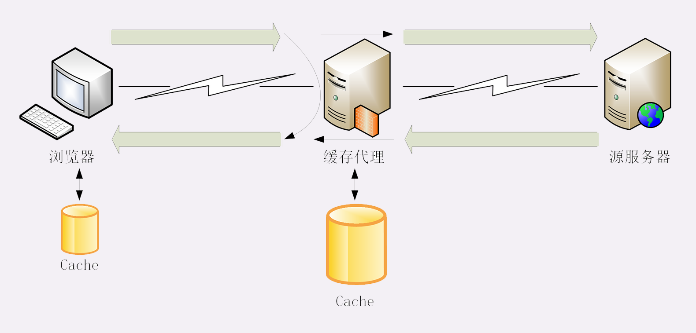
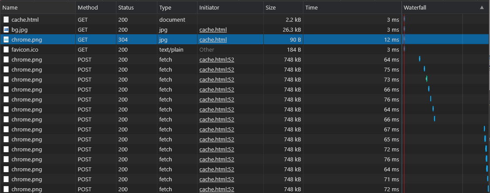
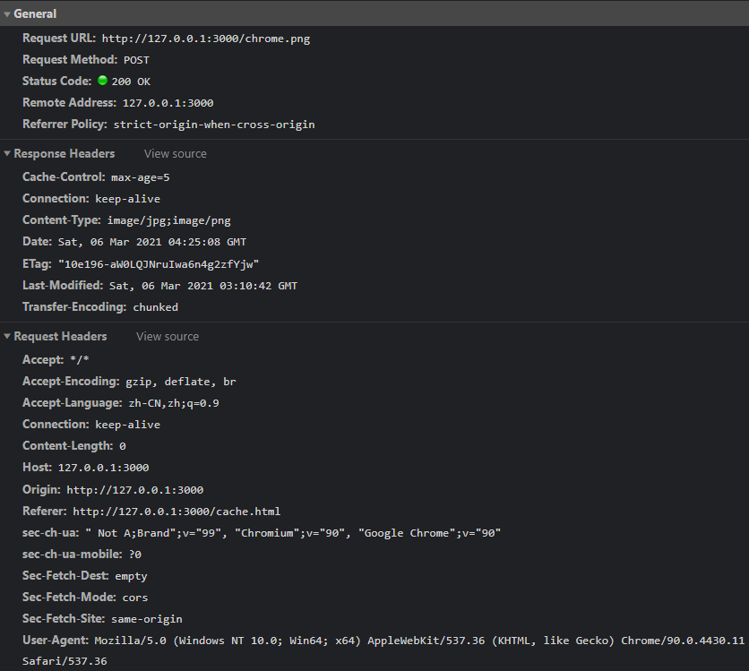
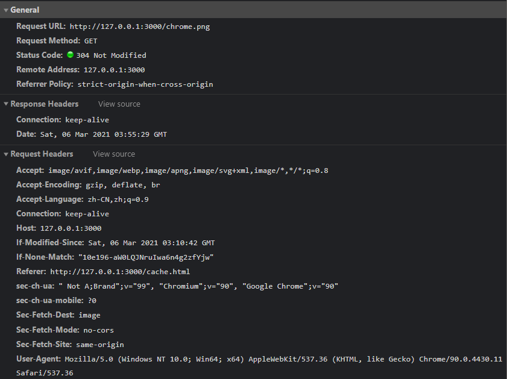
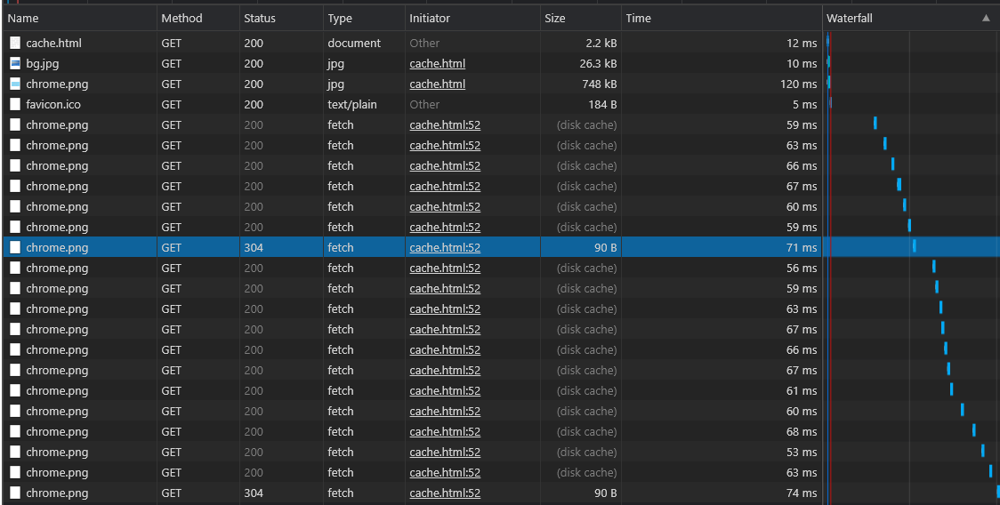
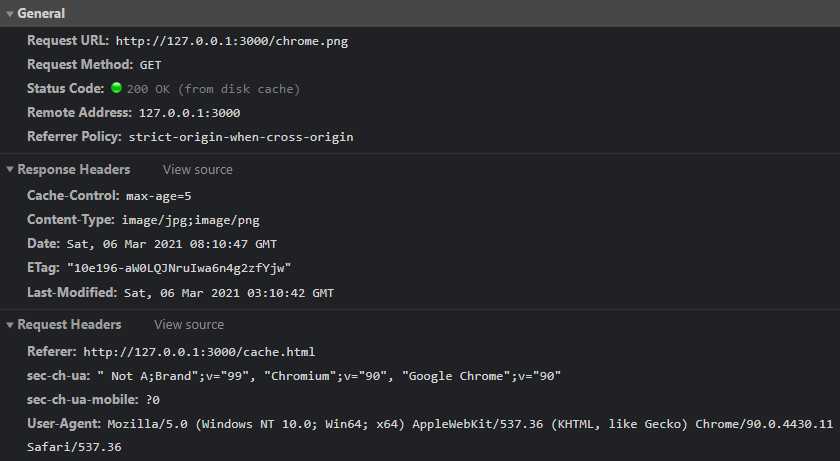

# 浏览器缓存

强制缓存优先于协商缓存进行，若**强制缓存(Expires和Cache-Control)**生效则直接使用缓存，若不生效则进行**协商缓存(Last-Modified / If-Modified-Since和Etag / If-None-Match)**，协商缓存由服务器决定是否使用缓存，若协商缓存失效，那么代表该请求的缓存失效，返回200，重新返回资源和缓存标识，再存入浏览器缓存中；生效则返回304，继续使用缓存。

## 强缓存

不会向服务器发送请求，直接从缓存中读取资源，强缓存可以通过设置两种 HTTP Header 实现：`Expires` 和 `Cache-Control`。

### Expires

- `Expires` 响应头包含日期/时间， 即在此时候之后，响应过期。无效的日期，比如 0, 代表着过去的日期，即该资源已经过期。
- 缓存过期时间，用来指定资源到期的时间，是服务器端的具体的时间点

- Expires 是 HTTP/1 的产物，受限于本地时间，如果修改了本地时间，可能会造成缓存失效

### Cache-Control

在HTTP/1.1中，Cache-Control是最重要的规则，主要用于控制网页缓存。比如当`Cache-Control:max-age=300`时，则代表在这个请求正确返回时间（浏览器也会记录下来）的5分钟内再次加载资源，就会命中强缓存。

| **指令**                | **备注**                                                     |
| ----------------------- | ------------------------------------------------------------ |
| `public`                | 表明响应可以被任何对象（包括：发送请求的客户端，代理服务器，等等）缓存，即使是通常不可缓存的内容。（例如：1.该响应没有``max-age指令或``Expires消息头；2. 该响应对应的请求方法是 POST 。） |
| `private`               | 表明响应只能被单个用户缓存，不能作为共享缓存（即代理服务器不能缓存它）。私有缓存可以缓存响应内容，比如：对应用户的本地浏览器。 |
| `no-cache`              | 在发布缓存副本之前，强制要求缓存把请求提交给原始服务器进行验证(协商缓存验证)。 |
| `no-store`              | 缓存不应存储有关客户端请求或服务器响应的任何内容，即不使用任何缓存。 |
| `max-age=<seconds>`     | 设置缓存存储的最大周期，超过这个时间缓存被认为过期(单位秒)。与``Expires相反，时间是相对于请求的时间。 |
| `s-maxage=<seconds>`    | 覆盖``max-age或者``Expires头，但是仅适用于共享缓存(比如各个代理)，私有缓存会忽略它。 |
| `max-stale[=<seconds>]` | 表明客户端愿意接收一个已经过期的资源。可以设置一个可选的秒数，表示响应不能已经过时超过该给定的时间。 |
| `min-fresh=<seconds>`   | 表示客户端希望获取一个能在指定的秒数内保持其最新状态的响应。 |
| `must-revalidate`       | 一旦资源过期（比如已经超过``max-age），在成功向原始服务器验证之前，缓存不能用该资源响应后续请求。 |
| `proxy-revalidate`      | 与must-revalidate作用相同，但它仅适用于共享缓存（例如代理），并被私有缓存忽略。 |

### Expires与Cache-Control比较

- 如果在`Cache-Control`响应头设置了 "max-age" 或者 "s-max-age" 指令，那么 `Expires` 头会被忽略。
- 在某些不支持HTTP1.1的环境下，Expires就会发挥用处。所以Expires其实是过时的产物，现阶段它的存在只是一种兼容性的写法。、

## 协商缓存

协商缓存就是强制缓存失效后，浏览器携带缓存标识向服务器发起请求，由服务器根据缓存标识决定是否使用缓存的过程。

- 协商缓存生效，返回304和Not Modified
-  协商缓存失效，返回200和请求结果

协商缓存可以通过设置两种 HTTP Header 实现：`Last-Modified `和 `ETag`。

### ETag

作为缓存的一种强校验器，`ETag` 响应头是一个对用户代理(User Agent, 下面简称UA)不透明（译者注：UA 无需理解，只需要按规定使用即可）的值。对于像浏览器这样的HTTP UA，不知道ETag代表什么，不能预测它的值是多少。如果资源请求的响应头里含有ETag, 客户端可以在后续的请求的头中带上 `If-None-Match` 头来验证缓存。

### Last-Modified

- `Last-Modified` 响应头可以作为一种弱校验器。说它弱是因为它只能精确到一秒。如果响应头里含有这个信息，客户端可以在后续的请求中带上 `If-Modified-Since` 来验证缓存。
- 如果本地打开缓存文件，即使没有对文件进行修改，但还是会造成 `Last-Modified` 被修改，服务端不能命中缓存导致发送相同的资源

### ETag与Last-Modified比较

- 在精确度上，Etag要优于Last-Modified。

Last-Modified的时间单位是秒，如果某个文件在1秒内改变了多次，那么他们的Last-Modified其实并没有体现出来修改，但是Etag每次都会改变确保了精度；如果是负载均衡的服务器，各个服务器生成的Last-Modified也有可能不一致。

- 性能上，Etag要逊于Last-Modified。

毕竟Last-Modified只需要记录时间，而ETag需要服务器通过算法来计算出一个hash值。

- 在优先级上，服务器校验优先考虑ETag。

## 新鲜度

理论上来讲，当一个资源被缓存存储后，该资源应该可以被永久存储在缓存中。由于缓存只有有限的空间用于存储资源副本，所以缓存会定期地将一些副本删除，这个过程叫做**缓存驱逐**。

另一方面，当服务器上面的资源进行了更新，那么缓存中的对应资源也应该被更新，由于HTTP是C/S模式的协议，服务器更新一个资源时，不可能直接通知客户端更新缓存，所以双方必须为该资源约定一个过期时间，在该过期时间之前，该资源（缓存副本）就是新鲜的，当过了过期时间后，该资源（缓存副本）则变为陈旧的*。*驱逐算法用于将陈旧的资源（缓存副本）替换为新鲜的，注意，一个陈旧的资源（缓存副本）是不会直接被清除或忽略的，当客户端发起一个请求时，缓存检索到已有一个对应的陈旧资源（缓存副本），则缓存会先将此请求附加一个`If-None-Match`头，然后发给目标服务器，以此来检查该资源副本是否是依然还是算新鲜的，**若服务器返回了** `**304**` **(Not Modified)（该响应不会有带有实体信息），则表示此资源副本是新鲜的**，这样一来，可以节省一些带宽。

若服务器通过` If-None-Match `或` If-Modified-Since`判断后发现已过期，那么会带有该资源的实体内容返回。

## 缓存位置

### Service Worker

Service Worker 是运行在浏览器背后的独立线程，一般可以用来实现缓存功能。使用 Service Worker的话，传输协议必须为 HTTPS。因为 Service Worker 中涉及到请求拦截，所以必须使用 HTTPS 协议来保障安全。**Service Worker 的缓存与浏览器其他内建的缓存机制不同，它可以让我们自由控制缓存哪些文件、如何匹配缓存、如何读取缓存，并且缓存是持续性的**。

### Memory Cache

Memory Cache 也就是内存中的缓存，主要包含的是当前中页面中已经抓取到的资源,例如页面上已经下载的样式、脚本、图片等。读取内存中的数据肯定比磁盘快,内存缓存虽然读取高效，可是缓存持续性很短，会随着进程的释放而释放。 **一旦我们关闭 Tab 页面，内存中的缓存也就被释放了**。

内存缓存在缓存资源时并不关心返回资源的HTTP缓存头Cache-Control是什么值，同时资源的匹配也并非仅仅是对URL做匹配，还可能会对Content-Type，CORS等其他特征做校验。

### Disk Cache

Disk Cache 也就是存储在硬盘中的缓存，读取速度慢点，但是什么都能存储到磁盘中，比之 Memory Cache 胜在容量和存储时效性上。在所有浏览器缓存中，Disk Cache 覆盖面基本是最大的。它会根据 HTTP Herder 中的字段判断哪些资源需要缓存，哪些资源可以不请求直接使用，哪些资源已经过期需要重新请求。并且即使在跨站点的情况下，相同地址的资源一旦被硬盘缓存下来，就不会再次去请求数据。

- **与Memory Cache比较**

- - 对于大文件来说，大概率是不存储在内存中的，反之优先
  - 当前系统内存使用率高的话，文件优先存储进硬盘

### Push Cache

Push Cache（推送缓存）是 HTTP/2 中的内容，当以上三种缓存都没有命中时，它才会被使用。**它只在会话（Session）中存在，一旦会话结束就被释放，并且缓存时间也很短暂**，在Chrome浏览器中只有5分钟左右，同时它也并非严格执行HTTP头中的缓存指令。

## 缓存代理

 HTTP 传输链路上，不只是客户端有缓存，服务器上的缓存也是非常有价值的，可以让请求不必走完整个后续处理流程，“就近”获得响应结果。

特别是对于那些“读多写少”的数据，例如突发热点新闻、爆款商品的详情页，一秒钟内可能有成千上万次的请求。即使仅仅缓存数秒钟，也能够把巨大的访问流量挡在外面，让 RPS（request per second）降低好几个数量级，减轻应用服务器的并发压力，对性能的改善是非常显著的。

HTTP 的服务器缓存功能主要由代理服务器来实现（即缓存代理），而源服务器系统内部虽然也经常有各种缓存（如 Memcache、Redis、Varnish 等）。

在 HTTP 的缓存体系中，缓存代理的身份十分特殊，它“**既是客户端，又是服务器**”，同时也“**既不是客户端，又不是服务器**”

## 字段

**Cache-Control**

- **max-age：**这里的 max-age 是“**生存时间**”（又叫“新鲜度”“缓存寿命”，类似 TTL，Time-To-Live），时间的计算起点是响应报文的创建时刻（即 Date 字段，也就是离开服务器的时刻），而不是客户端收到报文的时刻，也就是说包含了在链路传输过程中所有节点所停留的时间。
- **no_store**：**不允许缓存**，用于某些变化非常频繁的数据，例如秒杀页面；

- **no_cache：**它的字面含义容易与 no_store 搞混，实际的意思并不是不允许缓存，而是**可以缓存**，但在使用之前必须要去服务器验证是否过期，是否有最新的版本；
- **must-revalidate**：又是一个和 no_cache 相似的词，它的意思是如果缓存不过期就可以继续使用，**但过期了如果还想用就必须去服务器验证**。

- **private：**表示缓存只能在客户端保存，是用户“私有”的，不能放在代理上与别人共享。
- **public：**的意思就是缓存完全开放，谁都可以存，谁都可以用。

## Q&A

### 对于非GET请求，缓存是否生效

MDN有一句话**“****然而常见的 HTTP 缓存只能存储** `**GET**` **响应，对于其他类型的响应则无能为力。”，**这是不是意味着其他请求方法的HTTP缓存是失效的呢，于是用fetch写了个post请求，多次请求的结果状态码都是200，然而通过设置的GET方法确是生效了。

### 设置Cache-Control：no-cache后，协商缓存过程及后续请求

第一次请求图片时，正常从服务器获取到文件，此时可以看到，响应头返回了`ETag`和`Last-Modified`标识符，下一次请求时，请求头会带上这些信息。

第二次请求如下图，因设置了`Cache-Control=no-cache`，所以此时浏览器会跳过当前的强缓存，直接发送HTTP请求，即直接进入`协商缓存阶段`。可以看到，此时返回的状态码已经是304了，即意味着浏览器是从本地读取的资源。可以看到请求头部上有`If-Modified-Since`和`If-None-Match`这两个标识符，服务端便是根据这两个标识符去判断，因为该资源没有更新，所以返回状态码304。此后，继续刷新页面，只要资源没有更新，那么服务器便一直返回304（Not Modified）（该响应不会带有实体信息）。

### 设置Cache-Control：max-age=100后，协商缓存过程及后续请求

这里直接引用MDN的图， 其实很清晰了，在缓存时间过期后，服务端检测请求头部的`If-None-Match`标识符，发现资源并没有更新，返回304。然后浏览器重置缓存时间并将其缓存的文档返回给客户端。

上实例：服务端设置过期时长为五秒，即`Cache-Control：max-age=5`，然后配置协商缓存的内容。如图，可以看到，在强缓存的缓存过期后，进行了协商缓存，此时服务端返回了304，意味着该资源并没有更新。然后再继续请求，此后在缓存过期的时间内请求该资源，走的是强缓存，即从本地获取资源。

304 Not Modified

200 强缓存

## 资源

- [谈谈前端缓存 | 三元博客](http://47.98.159.95/my_blog/blogs/perform/001.html#expires)
- [HTTP 缓存 - HTTP | MDN](https://developer.mozilla.org/zh-CN/docs/Web/HTTP/Caching)

- [谈一谈对浏览器的强缓存和协商缓存的理解](https://zhuanlan.zhihu.com/p/64635421)
- [Hypertext Transfer Protocol (HTTP/1.1): Caching](https://tools.ietf.org/html/rfc7234)

- [深入理解浏览器的缓存机制](https://www.jianshu.com/p/54cc04190252)