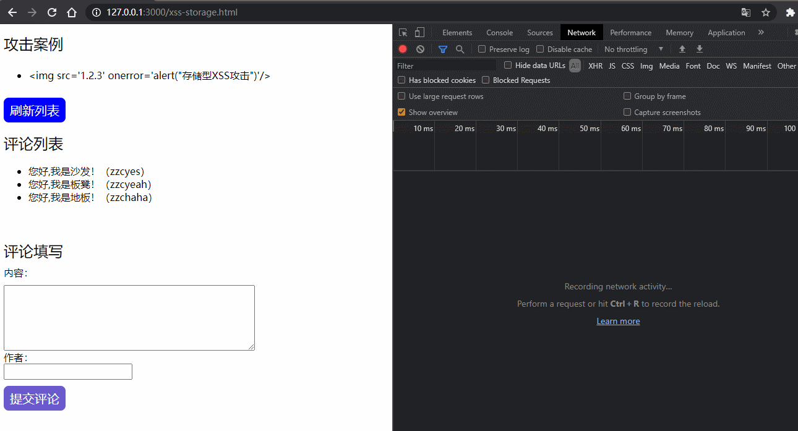
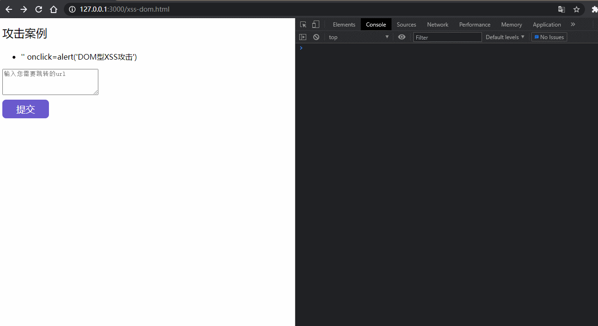

# 跨站脚本攻击（XSS）

## 概念

**跨站脚本**（Cross-site scripting，XSS）是一种网站应用程序的安全漏洞攻击，是代码注入的一种。它允许恶意用户将代码注入到网页上，其他用户在观看网页时就会受到影响。这类攻击通常包含了HTML以及用户端脚本语言。

跨站脚本的英文首字母缩写本应为CSS，但因为CSS在网页设计领域已经被广泛指**层叠样式表**（Cascading Style Sheets），所以将Cross（意为"交叉"）改以交叉形的X做为缩写。

2011年6月28日，新浪微博被XSS攻击，大量用户自动转发微博、私信。自动关注用户，大量用户被莫名其妙地控制。因为可以使用JS代码代替用户单击按钮发送请求，所以损坏非常大。

## 攻击危害

- 通过 document.cookie 盗取 cookie中的信息
- 监听用户行为，比如输入账号密码后直接发送到黑客服务器

- 使用 js或 css破坏页面正常的结构与样式（浮窗广告）
- 流量劫持（通过访问某段具有 window.location.href 定位到其他页面）

- dos攻击：利用合理的客户端请求来占用过多的服务器资源，从而使合法用户无法得到服务器响应。并且通过携带过程的 cookie信息可以使服务端返回400开头的状态码，从而拒绝合理的请求服务。
- 利用 iframe、frame、XMLHttpRequest或上述 Flash等方式，以（被攻击）用户的身份执行一些管理动作，或执行一些一般的如发微博、加好友、发私信等操作，并且攻击者还可以利用 iframe，frame进一步的进行 CSRF 攻击。

## XSS分类

根据攻击的来源，XSS 攻击可分为存储型、反射型和 DOM 型三种。

| **XSS类型** | **存储型 XSS**                               | **反射型 XSS**               | **DOM型**                    |
| ----------- | -------------------------------------------- | ---------------------------- | ---------------------------- |
| 触发过程    | 黑客构造XSS脚本正常用户访问携带XSS脚本的页面 | 正常用户访问携带XSS脚本的URL | 正常用户访问携带XSS脚本的URL |
| 数据类型    | 数据库                                       | URL                          | URL                          |
| 谁来输出    | 后端WEB应用程序                              | 后端WEB应用程序              | 前端JavaScript               |
| 输出位置    | HTTP响应中                                   | HTTP响应中                   | 动态构造的DOM节点            |

- 数据类型：恶意代码存放的位置
- 谁来输出：由谁取得恶意代码

- 输出位置：在哪里输出恶意代码

### 存储型XSS攻击

存储型 XSS 跟 反射型 XSS 的区别是：存储型 XSS 的恶意代码存在服务器上，反射型 XSS 的恶意代码存在 URL 里。

存储型 XSS 攻击时恶意脚本会存储在目标服务器上。当浏览器请求数据时，脚本从服务器传回并执行。它是最危险的一种跨站脚本，比反射性 XSS 和 DOM 型 XSS 都更有隐蔽性，因为它不需要**用户手动**触发。任何允许用户存储数据的 Web 程序都可能存在存储型 XSS 漏洞。若某个页面遭受存储型 XSS 攻击，所有访问该页面的用户都会被 XSS 攻击。

恶意脚本永久存储在目标服务器上。当浏览器请求数据时，脚本从服务器传回并执行，影响范围比反射型和DOM型XSS更大。

存储型XSS攻击的原因仍然是没有做好数据过滤：前端提交数据至服务器端时，没有做好过滤;服务端在按受到数据时，在存储之前，没有做过滤;前端从服务器端请求到数据，没有过滤输出。

#### 攻击步骤

1. 攻击者将恶意代码提交到目标网站的数据库中。
2. 用户打开目标网站时，网站服务端将恶意代码从数据库中取出，拼接在HTML中返回给浏览器。

1. 用户浏览器接收到响应后解析执行，混在其中的恶意代码也被执行。
2. 恶意代码窃取用户数据并发送到攻击者的网站，或冒充用户行为，凋用目标网站接口执行攻击者指定的操作.

这种攻击常见于带有用户保存数据的网站功能，如论坛发帖，商品评论，用户私信等。

#### 攻击示例

例子均以简单的弹窗来展示攻击效果

[完整示例-存储型XSS攻击-github](https://github.com/zzcyes/daily-demo/blob/main/network/safely/xss-storage.html)

### 反射型XSS攻击

反射型 XSS 一般是攻击者通过特定手法，诱使用户去访问一个包含恶意代码的 URL，当受害者点击这些专门设计的链接的时候，恶意代码会直接在受害者主机上的浏览器执行。反射型XSS通常出现在网站的搜索栏、用户登录口等地方，常用来窃取客户端 Cookies 或进行钓鱼欺骗。

通俗地讲，就是发出请求时，XSS代码出现在URL中，作为输入提交到服务器端，服务器端解析后响应，XSS随响应内容一起返回给浏览器，最后浏览器解析执行XSS代码，这个过程就像一次反射，所以叫反射型XSS。

攻击者诱导用户访问一个带有恶意代码的 URL 后，服务器端接收数据后处理，然后把带有恶意代码的数据发送到浏览器端，浏览器端解析这段带有 XSS 代码的数据后当做脚本执行，最终完成 XSS 攻击。
因为这个过程就像一次反射，故称为反射型 XSS。

#### 攻击步骤

1. 攻击者构造出特殊的URL，其中包含恶意代码
2. 用户打开有恶意代码的URL时，网站服务器端将恶意代码从URL取出，拼接在HTML返回给浏览器

1. 用户浏览器接收到响应后解析执行，混在其中的恶意代码也会被执行
2. 恶意代码窃取用户数据并发送到攻击者的网站，或者冒充用户行为，调用目标网站接口执行攻击者指定的操作

反射型 XSS 漏洞常见于通过 URL 传递参数的功能，如网站搜索、跳转等。

反射型 XSS 跟存储型 XSS 的区别是：存储型 XSS 的恶意代码存在数据库里，反射型 XSS 的恶意代码存在 URL 里。由于需要用户主动打开恶意的 URL 才能生效，攻击者往往会结合多种手段诱导用户点击。POST 的内容也可以触发反射型 XSS，只不过其触发条件比较苛刻（需要构造表单提交页面，并引导用户点击），所以非常少见。

#### 攻击示例

[完整示例-反射性XSS攻击-github](https://github.com/zzcyes/daily-demo/blob/main/network/safely/xss-reflect.html)

### DOM型XSS攻击

DOM 型 XSS 形成原因是通过修改页面的 DOM 节点形成的 XSS。

DOM 型 XSS 攻击中，取出和执行恶意代码都由浏览器端完成，属于前端自身的安全漏洞。

DOM型XSS攻击不用将恶意脚本传输到服务器，再返回客户端。取出和执行恶意代码均由浏览器端完成，属于前端自身安全漏洞。

当确认客户端代码中有DOM型XSS漏洞时，并且能诱使(钓鱼)一名用户访问自己构造的URL，就说明可以在受害者的客户端注入恶意脚本。利用步骤和反射型很类似，但是唯一的区别就是，构造的URL参数不用发送到服务器端，可以达到绕过`Web Application Frewall`、躲避服务端的检测效果。

也就是前端JavaScript代码不够严谨，把不可信的内容插入到了页面，在使用`.innerHTML`、`.outerHTML`、`.appendChild`、`document.write()`等API时要特别小心，不要把不可信的数据作为HTML插入到页面上，尽量使用`.innerText`、`.textContent`、`.setAttribut()`等。

#### 攻击步骤

1. 攻击者构造出特殊数据，其中包含恶意代码
2. 用户浏览器执行了恶意代码

1. 恶意窃取用户数据并发送到攻击者的网站，或冒充用户行为，调用目标网站接口执行攻击者指定的操作.

DOM 型 XSS 跟前两种 XSS 的区别：DOM 型 XSS 攻击中，取出和执行恶意代码由浏览器端完成，属于前端 JavaScript 自身的安全漏洞，而其他两种 XSS 都属于服务端的安全漏洞。

#### 攻击示例

[完整示例-DOM型XSS攻击-github](https://github.com/zzcyes/daily-demo/blob/main/network/safely/xss-dom.html)

## 防范措施

### 预防存储型和反射型 XSS 攻击

存储型和反射型 XSS 都是在服务端取出恶意代码后，插入到响应 HTML 里的，攻击者刻意编写的“数据”被内嵌到“代码”中，被浏览器所执行。

预防这两种漏洞，有两种常见做法：

- 纯前端渲染

1. 浏览器先加载一个静态 HTML，此 HTML 中不包含任何跟业务相关的数据。
2. 然后浏览器执行 HTML 中的 JavaScript。

1. JavaScript 通过 Ajax 加载业务数据，调用 DOM API 更新到页面上。

在纯前端渲染中，我们会明确的告诉浏览器：下面要设置的内容是文本（`.innerText`），还是属性（`.setAttribute`），还是样式（`.style`）等等。浏览器不会被轻易的被欺骗，执行预期外的代码了。

- 转义 HTML

如果拼接 HTML 是必要的，就需要采用合适的转义库，对 HTML 模板各处插入点进行充分的转义。常用的模板引擎，如 doT.js、ejs、FreeMarker 等，对于 HTML 转义通常只有一个规则，就是把 `& < > " ' /` 这几个字符转义掉，确实能起到一定的 XSS 防护作用，但并不完善。

### 预防DOM 型 XSS 攻击

DOM 型 XSS 攻击，实际上就是网站前端 JavaScript 代码本身不够严谨，把不可信的数据当作代码执行了。

- 在使用 `.innerHTML`、`.outerHTML`、`document.write()` 时要特别小心，不要把不可信的数据作为 HTML 插到页面上，而应尽量使用 `.textContent`、`.setAttribute()` 等。
- 如果用 Vue/React 技术栈，并且不使用 `v-html`/`dangerouslySetInnerHTML` 功能，就在前端 render 阶段避免 `innerHTML`、`outerHTML` 的 XSS 隐患。

- DOM 中的内联事件监听器，如 `location`、`onclick`、`onerror`、`onload`、`onmouseover` 等，`<a>` 标签的 `href` 属性，JavaScript 的 `eval()`、`setTimeout()`、`setInterval()` 等，都能把字符串作为代码运行。如果不可信的数据拼接到字符串中传递给这些 API，很容易产生安全隐患，请务必避免。

### 其他 XSS 防范措施

虽然在渲染页面和执行 JavaScript 时，通过谨慎的转义可以防止 XSS 的发生，但完全依靠开发的谨慎仍然是不够的。以下介绍一些通用的方案，可以降低 XSS 带来的风险和后果。

- Content Security Policy

严格的 CSP 在 XSS 的防范中可以起到以下的作用：

- - 禁止加载外域代码，防止复杂的攻击逻辑。
  - 禁止外域提交，网站被攻击后，用户的数据不会泄露到外域。

- - 禁止内联脚本执行（规则较严格，目前发现 GitHub 使用）。
  - 禁止未授权的脚本执行（新特性，Google Map 移动版在使用）。

- - 合理使用上报可以及时发现 XSS，利于尽快修复问题。

- 输入内容长度控制

对于不受信任的输入，都应该限定一个合理的长度。虽然无法完全防止 XSS 发生，但可以增加 XSS 攻击的难度。

- 其他安全措施

- - HTTP-only Cookie: 禁止 JavaScript 读取某些敏感 Cookie，攻击者完成 XSS 注入后也无法窃取此 Cookie。
  - 验证码：防止脚本冒充用户提交危险操作。

## 资源

- [跨站脚本攻击—XSS](https://juejin.cn/post/6844903943143718925#heading-5)

- [给你讲清楚什么是XSS攻击](https://www.cnblogs.com/54chensongxia/p/11643787.html)
- [001 谈谈XSS攻击 | 三元博客](http://47.98.159.95/my_blog/blogs/browser/browser-security/001.html#什么是-xss-攻击)

- [前端安全系列（一）：如何防止XSS攻击？ - 美团技术团队](https://tech.meituan.com/2018/09/27/fe-security.html)
- [HTML在线转义，HTML在线转义工具 —在线工具](https://www.sojson.com/rehtml)

- [DOM-XSS攻击原理与防御 - Mysticbinary - 博客园](https://www.cnblogs.com/mysticbinary/p/12542695.html)
- [XSS 攻击 - DOM 型 | Lync](https://lynchzou0114.com/network/xss-dom.html#dom-型-xss-的特点)